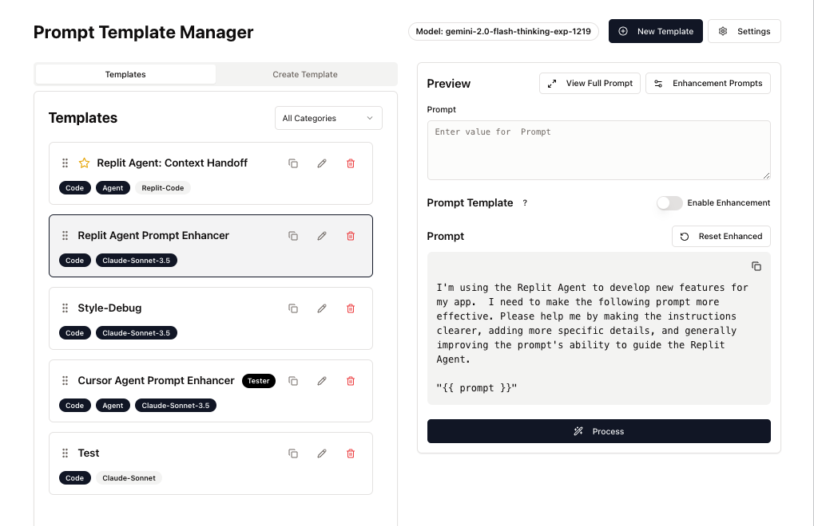

# Prompt Forge

<div align="center">
  
</div>

## Overview

Prompt Forge is a web application designed to empower users to create, manage, and enhance prompts for AI language models. Whether you're working with code generation, marketing, or education, Prompt Forge helps you craft more effective prompts through intelligent refinement and template management.

## Features

- 🎯 **Template Management**: Create and organize prompt templates for different use cases
- 🔄 **Real-time Preview**: See how your prompts will look before using them
- 🚀 **AI-Powered Enhancement**: Intelligent prompt refinement using advanced AI models
- 🎨 **Modern UI**: Built with React, Radix UI, and Tailwind CSS for a beautiful user experience
- 📱 **Responsive Design**: Works seamlessly across different devices and screen sizes

## Tech Stack

### Frontend
- React with TypeScript
- Radix UI for accessible components
- Tailwind CSS for styling
- Vite build tool

### Backend
- Node.js
- Express
- PostgreSQL with Drizzle ORM
- Gemini API integration

## Getting Started

1. Clone the repository
2. Install dependencies:
```bash
npm install
```
3. Set up environment variables (see `.env.example`)
4. Start the development server:
```bash
npm run dev
```

## Future Roadmap

- Expanded AI model support
- Enhanced customization options
- Community features for sharing templates
- Advanced AI agent integration

## License

MIT License - See LICENSE file for details 